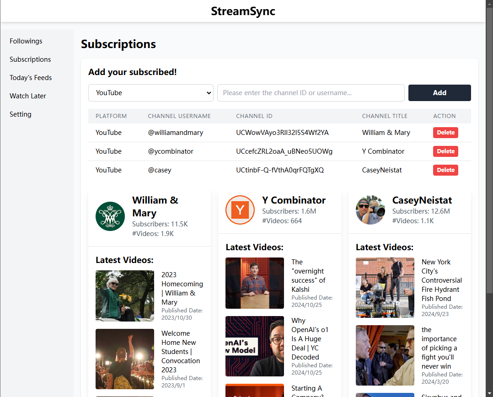
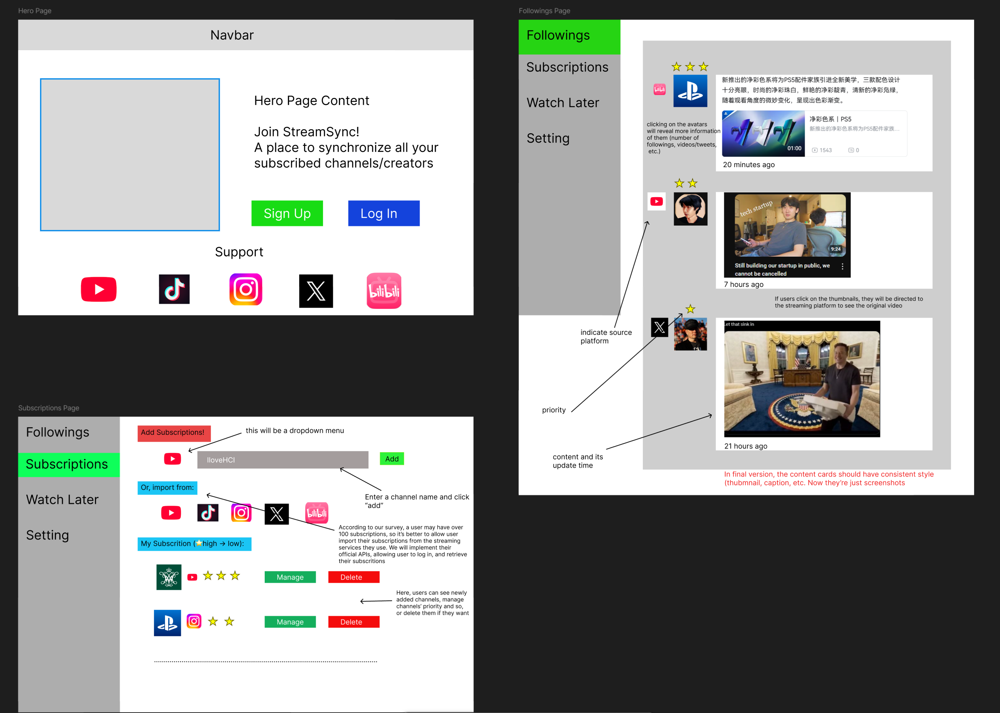

# StreamSync 🎯

[English](#english) | [中文](#chinese)

<div align="center">
  
  
  *All-in-One Creator Management Platform*
</div>

<div align="center">
  
  
  *StreamSync Design*
</div>

## English

### 🎯 About

A unified dashboard to track and manage your favorite content creators across YouTube, Instagram, Bilibili, X, and 小红书.

- Save your time
- Improve viewing efficiency
- Avoid platform recommendation algorithms
- Add weights to different follows, only watch what you really want to watch

### ✨ Features

🔄 **Cross-Platform Integration**

- YouTube, Instagram, Bilibili tracking
- Real-time content updates
- Unified subscription management

📊 **Smart Analytics**

- Creator statistics
- Engagement metrics
- Content performance

### 🛠️ Built With

**Frontend**


**Backend**


### 🚀 Quick Start

```bash
# Install & Run Frontend
cd client && npm install && npm run dev

# Install & Run Backend
cd server && npm install && npm run dev
```

---

## Chinese

### 🎯 简介

跨平台关注管理平台，把你的 YouTube、Instagram、Bilibili、X 和小红书等社交媒体上的关注内容更新整合到一个地方，帮助你

- 节省时间
- 提高观看效率
- 摆脱平台的推荐算法
- 给不同的关注添加权重，只看你真正想看的

### ✨ 功能

🔄 **多平台集成**

- 支持主流社交平台
- 实时内容更新
- 统一订阅管理

📊 **数据分析**

- 创作者数据
- 互动指标
- 内容表现

### 🛠️ 技术栈

**前端**


**后端**


### 🚀 快速开始

```bash
# 安装并运行前端
cd client && npm install && npm run dev

# 安装并运行后端
cd server && npm install && npm run dev
```

### 📝 开发计划

- [ ] 更多平台支持
- [ ] 推荐系统
- [ ] 移动端适配

---

## 📄 License

MIT © 2024 StreamSync
